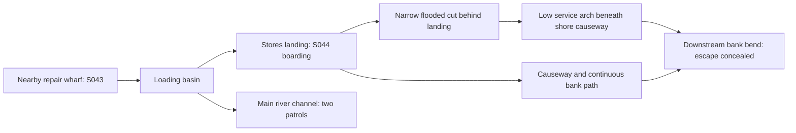

# Shared S043 boat → S044 upper-stores landing plan

**S043 production released after Chapter06 commit249dd88; S044 remains preparation only. User requested a pause after Chapter07.** This working geometry serves the requested S043 boat base and S044 landing base, and protects the causal escape described between them. It is not a new surveyed canon map or approval of an unmade image. Read complete source1684–1779, the Chapter07/08 preflights, `worldbuilding/original-locations.md`, current character designs and `visual-novel/visual-continuity.md`. Root's separate seasons prompt already calls for gray stone/high-window upper stores, broad loading barge and a subordinate rear cut/low arch; the plan below agrees with those broad features. The distant winter panel need not illustrate every route detail.

## Place and route

Keep the fortified upper stores on the river bank with HIGH windows and a guarded land entrance distinct from the loading front. A stout stone loading platform projects into the river; its shoreward service causeway passes over an old low quay opening. Rising water has reopened the narrow back channel between the rear of that platform and the shore. The opening/arch is ordinary quay infrastructure, not a magical tunnel or newly appearing hole.

Working plan-view convention: shore/stores are at the back of the view; main channel is in front, current travels left-to-right/downstream. The broad cargo barge moors against the outer loading face, reached by a real supported cargo gangplank. The two patrol boats operate on the main-channel side. The flooded cut branches from the basin beside the landing, passes behind it under the low service arch, then follows a bank bend out of sight downstream. There is no dead end or second disconnected arch. Soldiers can leave the landing along its actual causeway and follow a continuous bank path ABOVE/BESIDE the cut; they do not teleport across the water to fire after the boat.

The S043 repair wharf is a modest nearby upstream side berth, with a view toward the loading basin/rear-cut entrance and water rising against its own piles. It is not the guarded cargo gangplank itself. Four men can talk there without already being on the enemy loading platform. The next dawn's approach is a real move from that berth to the stores landing. Screen directions can change with camera, but shore, main channel, rear cut, arch and downstream bend must retain this relationship.

This diagram is a route dependency, not a literal scale drawing. The actual image must show the solid bank/landing supports and available water, rather than replacing them with labels or a maze of plank bridges.

## One low hired fishing hull

Use a weathered, ordinary wooden rowing fishing boat, approximately5–5.5m long and1.7–1.9m wide as working scale. It is a **new hired hull**, distinct from the surrendered household launch, Gray Scar ferry craft and Harrow search boat. No dignitary cabin, high bow, mast, engine or insignia. The boat has a shallow keel, low gunwales, a real stern transom/rudder/tiller, central rowing thwart with two oarlocks and enough clear interior for three adults: Serat at the oars, Lucan at the stern tiller, Marren forward of them/crouched inside. Seat widths, knees and feet must fit without stacked bodies.

Choose and preserve this identifiable repair: dull pale canvas/weatherproof cloth lashed over a short worn wooden patch along the **PORT AFT gunwale**. A few old stitches/pegs and a dark repaired plank below it show existing wear. This is not a brand-new hole or dramatic sinking breach. The source's canvas is at the repaired gunwale; no tall rigid canopy is needed. If a small weather cover appears, keep it low/foldable and consistently stowed, not a new high awning that cannot clear the arch.

Serat's two wooden oars use real oarlocks at the mid-thwart and can be brought fully INBOARD along the hull's length before the arch. Lucan's tiller connects to the stern rudder, and his movement from tiller to a ducked position beside Marren has a clear space to occur. The loaded hull stays afloat and stable with three men; no horizontal plank serving simultaneously as seat, river surface and hull wall.

At rising water, the arch has only roughly1.1–1.3m clearance above water at its crown and just enough width for the fishing hull with oars inside. All three can duck below that crown; the higher patrol bow cannot. The low boat drifts slightly against the PORT arch shoulder/side, scraping canvas from the old gunwale repair as the current carries it through. Do not make the fishing boat much smaller than three adults merely to clear the opening, or put an impossibly tall person sitting upright beneath it. Exact dimensions are working staging aids; the final actual hull/arch must be compared visually.

After the arch, a bolt makes a **NEW seam leak on the STARBOARD forward side**, away from the old port-aft repair. This side placement is a working continuity choice to distinguish two events. Marren crouches there and uses HIS OWN brown coat to press the new seam. The old patch and torn-away gunwale canvas remain identifiable elsewhere. Do not move the bolt hole to the old patch just to simplify composition or leave Marren fully wearing an impossible duplicate coat.

## Source-state ledger

| Moment | Cast/boat/prop state |
|---|---|
| S0431696 repair, then selected1709 | Lucan/Serat have paused repair; recurring boatman has delivered the warning; Serat sends younger brother for Marren's wife. Boat moored at side wharf, old port-aft patch intact, tools set down. Worn chart spread beside boat. Lucan's forearms healthy. Marren and wife absent. |
| S0441713–1731, selected base | Same boat alongside loading platform; Serat waits at real oars wearing a plain coat over uniform. Lucan stands on landing between Marren and approaching escort. Marren holds a crate to his chest, wearing the brown coat. Escort has not attacked, no blood or leak. Clerks load the separate stores barge. |
| S0441736–1745 | Marren shoves; escort draws sword; Lucan catches it on a loose packing lid and gains LEFT forearm cut; lid drives escort back against crates. Marren drops box and then takes the offered hand. These are sequential actions, not simultaneous with the earlier base. |
| S0441747–1751 | Two men board; Serat pulls off. Lucan steers the flooded cut, then ducks beside Marren; Serat brings both oars inboard. Current carries them under low arch; old port-aft gunwale canvas scrapes. |
| S0441753–1755 | High patrol bow stops at arch. Soldiers follow bank path; bolt makes new starboard-forward leak. Lucan returns to tiller until bend conceals them. Marren presses his brown coat into the new seam. |
| S0451759–1761 | Same wet arrivals reach infirmary. Marren's soaked boots below bed, wife holds him; his used wet coat must not magically become a dry duplicate. Healer dresses Lucan's LEFT forearm. Serat brings warning. |

Serat's Gray Scar LEFT-thigh wound is long recovered enough for this written rowing; no fresh open wound, splint or obligatory walking stick. His brother remains a younger narrower relative with longer tied hair/plain green coat and no lieutenant bar. He goes to fetch the wife before this extraction and is not a fourth passenger in the escaping boat. The recurring boatman is the older deep-brown graying-bearded man with low backward horns, dark cap and ocher weather coat, not the unrelated pale-hooded quarry pilot. Lucan's lost Gray Scar crossbow is not retrieved here.

## S044 selected base and coverage limit

The requested `s044-upper-stores-landing.png` is source1731: Lucan between Marren and the escort, with Serat at the moored boat and loading clerks behind. Set a clear boarding edge with a small achievable gap/height difference; a loose packing lid and stacked crates within later reach can exist without being used early. The larger barge's cargo plank is separate from the fishing boat's boarding edge. Main hands, crate and boat/oar contact must remain above UI boundaries. The low cut/arch can appear as subordinate route geography, but this base must not simultaneously show wounded Lucan, Marren aboard, patrol chase, arch scrape and coat plugging a leak. Those later states remain an explicit integration coverage gap in the current base-only request; no extra image is authorized by this plan.

Actual S043 hull/repair/tiller/oarlock geometry must be reviewed before S044 generation; actual S044 placement must be checked again against it. Root/independent reviewers should trace the continuous route and human support, then inspect native hands/boat components, rather than accept a written map as proof.

## Actual S043 source foundation; runtime integration remains pending

The selected source painting shows four ordinary adults on the near timber repair wharf, a real waist-height chart workbench, and the hired hull moored diagonally with its bow farther left and stern near right. Port is the wharf-facing near side: the single dull canvas patch sits aft near the transom. Two oars are stowed inboard; the central working rowing area is partly occluded by the departing brother, so later views must reveal the real paired oarlocks rather than duplicate a bow tie-eye as an oarlock. The stern's upright stock supports one inboard wooden tiller; lower iron fittings are rudder hinges. The hull floats across a distinct narrow water gap and mooring lines meet real wharf posts.

The stores/loading barge sit behind the side berth, and the service cut passes beneath the right causeway to the continuing bank path. The initial opening was too high for the written escape; a local component lowered its inner crown relative to nearby full-size soldiers while retaining water level, causeway top and opening width. This physical correction avoids relying on an implausible overnight water rise. Future S044 must reuse this actual lower arch and boat/repair construction after the user resumes; no S044 generation is part of the current round.

Final actual `s043-seasons.png` was independently compared at whole/native size: winter's close gray high-window loading façade and broad cargo hull agree with the distant stores complex in the repair-wharf view. Its visible stone bridge belongs to the far southern town bank and is not the small rear service-cut arch. Supported loading plank/crate transfer and northern/southern flag distinction are coherent. No geometric contradiction was found between these different cameras. This comparison does not replace future S044 boarding/escape staging checks.
