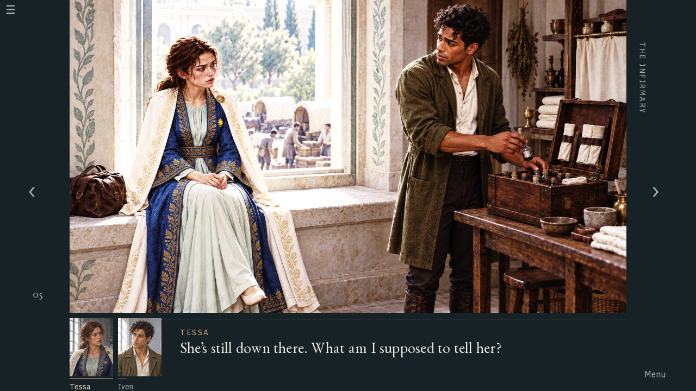

# An afternoon — controlled design proof

**Status: rejected.** The proof was rejected for stripping the ambition from the interface, as recorded in [trial 2](../window-trial-2/README.md). See the [window failure review](../../reviews/2026-09-23-window-failure/README.md). Keep it as failure evidence, not as a layout, portrait or style reference. The favorable assessment below is the producing model's and did not hold.

The user authorized this pass on 17 September 2026. It is isolated from the rejected 0.4.0-dev runtime. This is one short exchange, not rollout or scene-completion approval.

## Scene brief

Source: `screenplay/original-timeline/source.fountain`, S005, lines 216–250. Immediately before this, Iven has challenged the order to send Tessa with the convoy; immediately afterward, the screenplay cuts ahead five weeks. Preserve every line of this conversation.

Tessa, nineteen, sits at the infirmary window with her travel bag beside her. Iven, twenty-six, packs his open medical chest within reach on the right. The convoy yard lies below the window. The mother approaches the wagons; later Mara assigns the two guards. Tessa does not leave the sill. Iven puts the bottle down, admits his inability to prevent the demands, promises to accompany her, then sits in the space she makes beside her. The chest stays open. Both Tessa's hands are healthy. Her bag, Iven's satchel and his medical chest are different objects.

Tessa wears the celadon under-robe, lapis brocade long coat, white/gold mantle and twelve-short-ray sun badge. Her selected likeness is the central woman in the storm infirmary, aged back to nineteen without injury or field clothes. The ceremonial key is clothing support only. Iven's olive coat, linen shirt and short curls follow the written design and inspected working key; no apron, later torn sleeve or injury. Neither a failed portrait nor a failed review is a reference.

This ordinary daytime scene has uncomfortable window glare across the people and stone, with a coordinated optional Softened grade. The main illustration remains fully visible. The screen studies use the same existing scene and line 228. Temporary crops in those first studies establish placement only; they are replaced by purpose-composed upper-bust portraits before delivery.

## Initial complete-screen comparison

1. Inset caption: the scene remains large, but the dark overlaid rectangle retains the furniture-like character of the rejected direction.
2. Side reading column: preserves the full illustration, but separates compact acting from the reading line and forces a wide lateral attention jump.
3. Separate lower reading area: preserves the entire image, groups the compact pair beside the dialogue, and gives the reading surface its own space. Develop this one for the bounded proof. This preference is the maker's judgment, not user approval.

The initial screenshots are retained in `review/studies/`. All three use the same art and text and were rendered by Ren'Py before new portrait production.

## Play and compare

- Browser: [play](http://127.0.0.1:8043/) · [compare the three complete layouts](http://127.0.0.1:8043/compare.html).
- Native, from the repository root: `visual-novel/prototypes/window/play.sh`.
- Rebuild browser: `visual-novel/prototypes/window/build-web.sh`, then `visual-novel/prototypes/window/play-web.sh`. The proof uses port 8043 and its own save directory. The existing runtime/server is separate.
- Click the scene, press Space/Enter/Right, or use the right arrow to advance; Left or the left arrow goes back. Menu contains reading history, save/load, Threads, lighting, larger type, and the three comparison compositions. The final page offers Look closer. Reader-discovered Threads belong to the current playthrough/save and survive save/load; lighting and type preferences persist independently.

### Delivered direction

The default composition uses the complete illustration above a separate reading area. The compact pair stays together beside the line; names and a brass-colored underline identify the speaker. Questioning/listening expressions alternate, and Iven lowers his gaze on his admission before looking back to Tessa for the promise. Narration removes the compact pair and leaves the staged action in charge. Utility controls occupy the margins.

The tradeoff is a smaller illustration with side margins. The broad space beside a very short reply is still visible; it is plain reading space, without the previous ornamental panel over the action. This is a concrete candidate for feedback, not proof of good taste or an approved game-wide solution.

The optional chest connection reframes Iven's packing hand, then the pair sharing the sill. Its short authored interpretation is limited to this scene: the packing can wait while he sits with her. It does not add ancient history, change character knowledge, or claim to finish the larger discovery design.

### Assets and reuse

| Asset | Scene role and state | Provenance / treatment |
| --- | --- | --- |
| `game/art/window-packing.png` | Tessa seated with bag, Iven holding bottle over chest | Reassessed existing Rovel CG; full frame retained, hands/bag/chest visible |
| `game/art/window-pause.png` | Bottle put down, open chest, Iven still standing | Reassessed existing CG; continuous seat and chest geography |
| `game/art/window-together.png` | Tessa makes room, Iven sits, chest remains open | Reassessed existing CG; final staged image, no compact portraits |
| `game/art/convoy-mother.png` | Mother approaches wagons below the window | Reassessed existing courtyard cutaway |
| `game/art/convoy-guards.png` | Mara assigns two guards | Reassessed existing courtyard cutaway |
| [Tessa questioning](game/art/tessa-question.png) / [listening](game/art/tessa-listen.png) | Nineteen, ceremonial coat/mantle, healthy; face directed right | New built-in imagegen portrait painting; selected storm likeness plus costume-only key; GIMP corrects badge, composes panels and grades |
| [Iven listening](game/art/iven-listen.png) / [admitting uncertainty](game/art/iven-admit.png) | Twenty-six, olive coat and linen shirt, no apron/injury; attention left | New built-in imagegen painting from written design and inspected working key; GIMP panel composition and grades |

Every runtime image has its corresponding `game/art/softened/` export. These five older scene illustrations were inspected for this bounded reuse; they were not fed back as approved generation references. They are held illustrations, with compact acting carrying the shorter changes of attention. No new whole-scene illustrations were generated.

[Full prompts](../../art/prompts/window-proof/) record the two built-in calls and reference roles; raw sheets are in [art/raw](art/raw/). The [GIMP finishing script](art/finish.scm) runs from the repository root. The [masters](art/masters/) retain the separately editable cloth repair, twelve-ray construction and masked original brass disk in `tessa-badge-repair.xcf`, plus separate Intense/Softened layers in each portrait master. The initial dark cloth-patch repair was replaced after inspection. The portraits are painted rectangles with connected neck/shoulders, not alpha head cutouts.

### Review and limits

Look at the [matched final comparisons](review/comparisons/) before their explanations. [Initial studies](review/studies/) preserve the compositions rendered before portrait generation, with temporary scene crops; they are not final portrait assets. [Browser screens](review/browser/) retain the complete 13-page sequence at 1280×720. [Additional evidence](review/final/) includes Softened/larger type and discovery.

The sequence was traversed in the browser with pauses, then its complete screens were opened in source order. The window/courtyard/window cuts keep the external demand present; the bottle action interrupts the exchange before the admission; the final seated image lets the small promise land. Reading position remains stable within dialogue. This is the producing model's assessment, not independent human pacing evidence; scripted pauses are not a measured human reading time. The compared screenshots do not establish animation quality by themselves.

Ren'Py lint passes. Native navigation/discovery/save/load/preference checks pass (34 assertions). The final browser build also passes real-control save/load, discovery/Threads return, lighting/type changes, and all three comparison image selections at 1280×720, with an additional 1024×768 larger-type inspection; all 13 source blocks are preserved, with typographic apostrophes as the only text change. Four portrait XCFs were reopened and both visible grade exports reproduced pixel-for-pixel. Those are engineering findings, not aesthetic approval.

This is one ordinary-daylight conversation. It does not validate night/near-blinding scenes, other cast, the whole S001–S005 milestone, or the full route. The controls deliberately stop expansion here. The user's response to this actual result is the next input for art direction.
