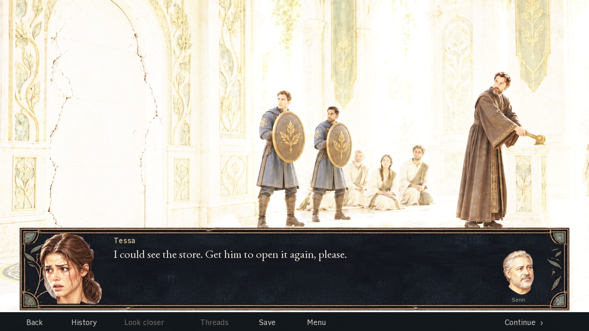
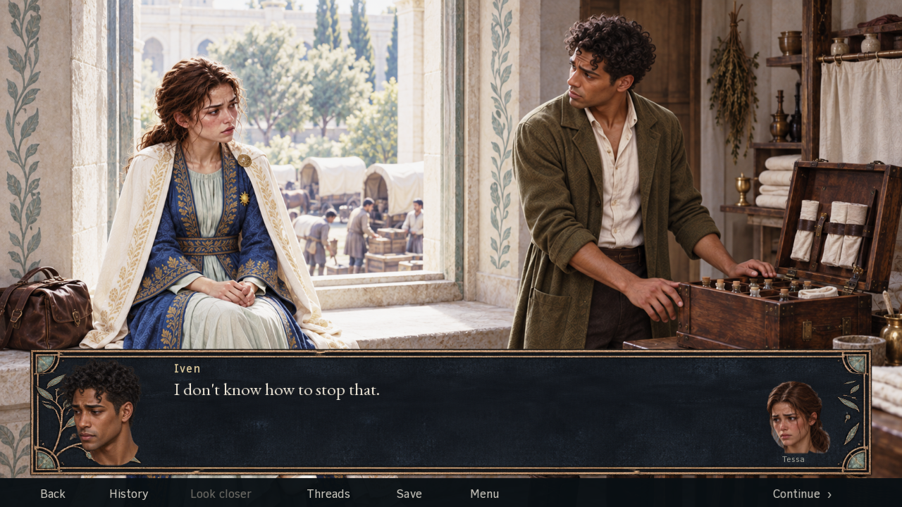
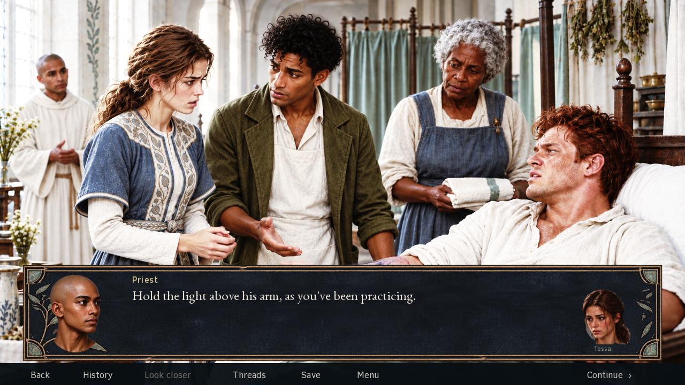

# Why the Rovel attempt failed

**Verdict: failed.** The user rejected 0.4.0-dev on 17 September 2026, then requested an archival commit and detailed documentation/control changes. The archive is `1bb6d767fc1b6cac910c34aaecec3ab11dd37921`. The [previous review](../2026-09-17-rovel-work/README.md) preserves the session's claims and technical findings. [Production controls](../../production-controls.md) now govern the recovery; this review does not begin new art or UI production.

## User correction

The new UI stretches better but is uglier, still blocks too much of the scene, and retains too much of the earlier rejected presentation. The compact face views have unacceptable composition/cropping. The user asked how to prevent hours of work producing another weak result. The assistant initially announced documentation edits in response to that question; the user corrected that assumption. No edits had occurred at that point. The subsequent request explicitly authorized this archive and documentation/control update.

The correction rejects the execution. It preserves richly illustrated scene work, compact speaker/listener frames where useful, selected likenesses, the three lighting registers, Softened, the original route and Look closer / Threads.

## Evidence inspected and limits

Inspected the current UI/descriptor/finishing code, generation prompts, prior reviews, selected native portrait exports and retained full runtime screenshots. The retained native capture project's `rovel-ui.rpy` matches the archived source, SHA256 `64259f202d1ab8e3d441ce6e31e6dbf3ef874bfc6b0e33b1df4892b7bc1a3f5c`. Selected captures are copied byte-for-byte into [evidence/](evidence/), with source paths and hashes in [evidence.json](evidence.json). They are failure evidence, never style/likeness approval.

This is a bounded diagnosis using retained captures, not a fresh uninterrupted playthrough, an all-portrait inspection, or a claim that every image failed for the same reason. Raw PNG viewing can show RGB beneath transparent alpha; composited runtime captures govern claims about visible background remnants. No such remnant is asserted solely from the raw portrait previews.

## Visual failures the review should have rejected

### One sentence inside a dominant ornamental panel

The lower screen reads as a large decorative object containing one line and two detached heads. The vacant textured area is visually substantial. Tessa's hair and neck sit over the engraved branch; Senn's smaller head ends in a free neck shape above a tiny name. Neither portrait has a convincing enclosing composition. The picture does not become well designed because attribution is technically possible or the panel stretches cleanly. A reviewer should identify that immediately from this complete screen.

The correction needs a composed relationship between scene, text and portraits. Making this same rectangle less ornate or trimming a few pixels from its height does not by itself establish that relationship. There is no approved replacement design in this review.

### Detailed scene art does not rescue pasted portrait presentation

This illustration already gives the pair meaningful presence, posture and attention. The lower panel adds another pair of faces, ending abruptly at the neck, beside a very short line. The reviewer needed to judge whether those duplicate performances helped this beat and whether their treatment belonged to the illustration. Instead, the implementation's categories—scene illustration, speaking portrait, listening portrait—were treated as sufficient evidence of the requested blend.

The visible lower boundary and portrait/frame relationship are composition problems even if the alpha mask is clean. Equal square export sizes are also insufficient: compare how much of each square the face occupies and how the neck ends. Compact frames remain required where useful; this example rejects their execution, not the capability.

### Reading furniture hides the action the words refer to

The instruction directs attention to Olan's arm, while the panel occupies the lower treatment area. The priest's portrait has the same detached lower neck treatment, and Tessa is repeated as a small face at the far right. The overall arrangement needed visual reconsideration before more exports, scenes or verification reports. An unobstructed source illustration does not clear what the player sees with the interface present.

The [ceremony](evidence/ceremony.png) and [night](evidence/night.png) examples expose the same design in different scenes. [Discovery](evidence/discovery.png) shows the stretched surface used at another scale. These are evidence to inspect, not six automatically scored cases or a claim that every screen has the same defect.

## Implementation context, after visual judgment

| Finding | Evidence and cause | Why the prior checks missed the issue |
| --- | --- | --- |
| Large surface for very little reading | [Tessa's reply](evidence/short-reply.png): one line over an almost full-width panel. `rovel_reading` uses a fixed 1800×280 dialogue panel on a 1920×1080 canvas; `quick_menu` adds a 1920×62 footer. Their nominal rectangles occupy 30.05% of the canvas. Much of the panel is empty texture | Text containment establishes fit, not proportion, hierarchy or visual value. A numerical area threshold alone would also be insufficient |
| UI competes with meaningful scene information | [Treatment instruction](evidence/treatment.png) covers the lower arm/bed area while the instruction refers to that arm; [Orra's exchange](evidence/ceremony.png) overlays the steps/footing and lower bag area. Important action cannot be assessed only in UI-free source art | Some narration pages received individual placement fixes, while the general spoken-dialogue layout retained its large surface |
| Portraits read as detached cutouts | The short reply, ceremony and [Iven exchange](evidence/window.png) show abrupt lower neck shapes, uneven apparent head scale and heads placed against frame ornament. The far-right listener reads as a separate small icon | Prompts explicitly requested head-only sheets; `rv-portrait` slices them into square canvases and masks/fades the bottom. Equal export dimensions and valid alpha do not establish deliberate portrait composition |
| Scene and compact acting are poorly integrated | The short reply shows the room/guards with the principal pair absent from the scene, while the treatment/window screens duplicate scene faces in the panel. The useful choice depends on the beat; applying a single rule does not direct attention | Compact mode forcibly empties the stage actor list, and all dialogue was assigned to that mode. Coverage can be technically complete while the relationship between the main image and the portraits remains weak |
| Replacement frame keeps the same basic design problem | The new generated surface retained a dark ornamental rectangle with botanical/gilt edges, followed by a separate utility strip. Stretchable edges improve construction but leave the large furniture-like reading treatment | The frame prompt asked for a polished blank component before the complete composition and reading flow had proved themselves |

The three-register lighting direction remains a user requirement. This diagnosis does not use the rejection as permission to normalize scene exposure, change Tessa's identity or discard detailed illustrations.

## Process failures

1. **The quality gate came too late to control spending.** Existing instructions already required a convincing representative sequence. The production brief even listed a small interface/portrait experiment before extension. Nevertheless, 95 pages and 88 portrait variants were produced while the final screen-family judgment and natural-paced experience review remained open. The available record does not prove no early experiment occurred; it proves that the process failed to stop expansion of this weak result.
2. **The reviews made the wrong acceptance judgments.** There was substantial inspection, including the main thread's reported opening of all 95 Intense compositions. Calling everything “unreviewed” would conceal that failure. The positive observations about frames and portraits were insufficiently critical of their composition in the game. Reopening XCFs, matching export bytes and passing 152 assertions did useful technical work but did not establish visual quality.
3. **Disclaimers had no consequence for visual direction.** Repeated “not user approval” and “not a blanket artistic pass” statements accompanied a growing implementation. Those qualifications did not repair the model's wrong judgments. The next direction must be demonstrated through a small finished visual example and actual response before that judgment drives another batch.
4. **Tests hardened implementation choices into requirements.** `check-rovel-plan.py` required every spoken page to be compact, required its stage actor list to be empty, and required `face-only-no-costume-or-props`. These were design choices, not screenplay or user requirements. The control update removes those assertions while retaining source/state/asset checks.
5. **Status drift encouraged continuation.** “Working candidate” appeared in entry-point documents while the route inventory and runtime guide also retained older coverage claims. Future sessions could choose the convenient account. Current instructions, plan, ledger and guides must agree that this version failed and that the next production delivery is a bounded proof.
6. **Responsibility for the experience was not discharged.** Component delegation and lead inspection were both recorded; their existence did not make the complete result good. The lead must decide whether the scene, text, portraits and controls work together and reject visible failures before dependent work. More agents alone would not resolve shared assumptions.

## Recovery and current gate state

| Gate | State after rejection |
| --- | --- |
| Whole experience | Failed |
| Source and staging | Prior bounded checks only; no new whole-scene clearance |
| Conversation and performance | Failed for the current portrait/presentation execution |
| Art, identity and light | Portrait composition failed; other assets retain their individual evidence limits |
| Complete interface | Failed |
| Discovery and return | Historical functional evidence; overall presentation not cleared |
| Technical and route regression | Historical technical passes; later coverage still incomplete |

The next production delivery, when requested, is two or three materially different complete layouts and one short polished connected exchange. It must expose the relationship between scene art, text, portraits, utilities and reading rhythm. Deliver it and establish direction through the actual visual result and response before extending it into S001–S005. The current task authorizes this archive and documentation/control update only.

The user corrected the first proposed control update for overemphasizing algorithmic review instead of the model's failure to notice obvious faults. That build/scope machinery was removed before the documentation commit. The final [controls](../../production-controls.md) center on these actual images, comparative judgment, deliberate portrait composition and an early finished example whose direction is not established solely by the producing model's own favorable review.

There is no claim that documentation fixes model perception or guarantees taste. If a reviewer still cannot distinguish these faults from good composition, it has not demonstrated competence to approve the visual direction. Technical checks and more confident prose cannot make that judgment reliable.

## Documentation update verification

The source adapter check and revised Rovel source/asset check passed. Local links in the changed Markdown files resolve, and all six preserved screenshots match their provenance hashes. Build/launch scripts remain unchanged from the failed archive. No new art, runtime UI edits, game rebuild or full experience review was performed during this update. These are checks of this documentation/control change, not a revised visual verdict.
