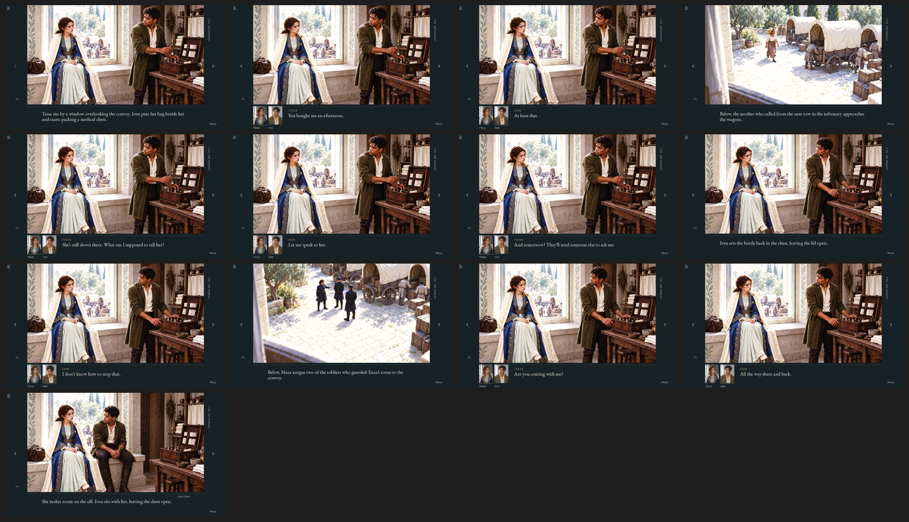

# Window proof and trial 2 — another failed attempt

**Verdict: failed.** Recorded 23 September 2026. The analysis below is Claude's, made from the committed screens, code and history; it is not a user-approved account.

- The committed [window proof](../../prototypes/window/README.md) (`4001475`, 17 September) was rejected. Trial 2's notes record the reason: it stripped the ambition from the interface.
- [Trial 2](../../prototypes/window-trial-2/README.md), archived with this review, stopped before it reached a playable exchange. Its two initial comparisons repeat the proof's problems inside new frames.
- On 23 September the user judged the whole game interface and UX still far too rough.

This is the fifth rejected presentation, after the first playable build, the staged opening, 0.3.2 and 0.4.0-dev (Rovel). Trial 2 is the proof's unfinished sequel.

## What the screens show

- **One composition is held for the whole exchange.** Ten of the thirteen pages show the same window painting; the only staged change is Iven setting the bottle down. From one line to the next, the visible difference is an underline beneath two portrait thumbnails 120 px wide at 1080p. Expression changes at that size are a few pixels of mouth or gaze.
- **Three layouts are one layout.** The [comparisons](../../prototypes/window/review/comparisons/) move the same dark text band to the bottom, the side and below the picture. The control written an hour earlier says [that is not a distinct solution](../../production-controls.md#establish-the-standard-with-actual-pictures).
- **The self-review described intent, not pixels.** The proof's notes claim "uncomfortable window glare across the people and stone"; the screens show warm, flattering, evenly lit daylight. The filed discovery evidence, [closer.png](../../prototypes/window/review/final/closer.png), was captured mid-crossfade, with a ghosted title over Tessa's head and a translucent box over Iven.
- **The parts do not belong together.** The new portrait paintings are good on their own. But Tessa's keeps the cold, rain-streaked window of her likeness reference under a sunlit scene, Iven's has a different grey backdrop, and the Tessa in the thumbnail is not the face painted in the scene above her.
- **Discovery restates the scene.** Look closer shows two crops of the picture already on screen, captioned "His hands were busy." and "She makes room beside her."
- **Trial 2 continued the pattern.** [Nightglass](../../prototypes/window-trial-2/review/comparisons/01-nightglass-initial.png) and [Vellum](../../prototypes/window-trial-2/review/comparisons/02-vellum-initial.png) put the same thumbnails in arched frames over a wash covering the lower third, with ornaments its own notes call flat clip art. Its runtime art is byte-identical to the proof's. A new pair of Tessa paintings was generated but never integrated.

## Why the attempts keep failing

1. **The unit of presentation was never designed.** [`story.rpy`](../../renpy/game/story.rpy) is generated: one screenplay block becomes one page with one looked-up background. 458 of the 852 pages are screenplay action lines shown verbatim, including casting notation such as "TESSA RUSK, nineteen,". Every attempt rearranged a picture, a text rectangle and a name on top of that unit. None changed how a beat is staged or read.
2. **Aesthetic requirements became checkable proxies.** The lighting registers became one global curves preset per mode ([relight-opening.scm](../../tools/relight-opening.scm)), producing milky bright scenes and night scenes where the speaker cannot be seen. Portrait composition became numeric crop targets. "Beautiful" became passing assertions and hash-matched exports.
3. **Components were made in isolation.** Portraits, scene paintings and frames were generated and finished separately, then assembled, so faces, backdrops and light disagree on the same screen. The selected storm-infirmary study works because light, texture, costume and emotion were decided in one picture.
4. **The interface never had a concrete target.** Each attempt fell back on a generic pattern: web dashboard, clip-art filigree, gilded panel, photo gallery.
5. **Throughput and documentation outran judgment.** All five presentations were built in about 18 hours; Rovel's 95 pages and 88 portrait variants took about four. Each rejection produced a long document and a literal, local fix, and the dominant structure survived. The documents diagnosed the judgment failure correctly; the next delivery repeated it.

## Direction after this failure

On 23 September 2026 the user directed an interface and infrastructure pass across the whole game: make the game itself work well, using existing assets and interface elements drawn in code rather than generated by diffusion. Scenes and images the game needs are collected as a generation request at the end of these rounds. The pass generates no illustrations and approves no design in advance.
